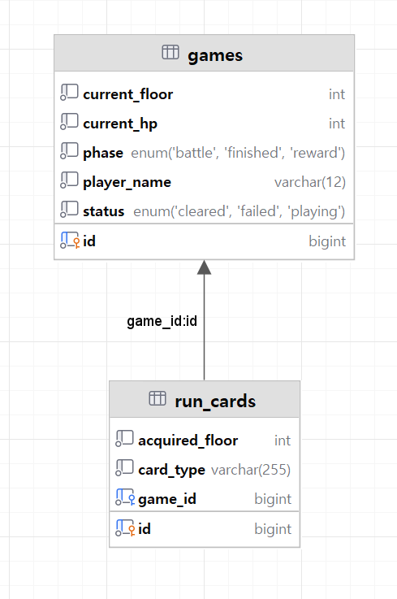

# Crimson-Citadel 🌕
## 붉은 달의 성채 🏰🧛
> 붉은 성채 10층을 오르는 카드 배틀 로그라이크 게임입니다.
> 
> - [게임 소개](#게임-소개)
> - [기술 스택](#기술-스택)
> - [API명세](#API명세)
> - [ERD](#ERD)
> - [구현 범위](#구현-범위)

# 소개

> 1층부터 10층까지로 구성된 카드 배틀 로그라이크, 붉은 달의 성채의 백엔드 서버입니다.   
> 브라우저 게임 클라이언트가 이 서버에 여정(Game)과 덱(RunCard)을 저장하고, 다시 접속하면 이어서 플레이합니다.
> Spring Boot로 3 Layer Architecture, JPA 연관관계, Bean Validation, 전역 예외 처리를 학습하는 프로젝트 입니다.   
---
# 기술 스택

| 구분      |사용기술|
|-----------|---|
| Language  |Java 21|
| FrameWork |Spring Boot 4.1.0 (Spring MVC, Spring Data JPA, Bean Validation)|
| Database  |MySQL 8.4 (Docker), 테스트는 H2|
| Build     |	Gradle|

---
# API명세
### BaseURL은 http://localhost:8080, 모든 요청과 응답은 application/json 형식입니다.

| 메서드 | 경로            | 설명                         | 성공 응답 |
|--------|-----------------|------------------------------|-----------|
| POST   | /games          | 게임 생성                    |201 Created|
| GET    | /games          | 게임 목록 조회(ID 내림차 순) |200 OK|
| GET    | /games/{gameId} | 게임 상세와 전체 덱          |200 OK|
| PATCH  | /games/{gameId} | 플레이어 이름 변경           |204 No Content|
| PUT    | /games/{gameId} | 진행 필드와 전체 덱 저장     |200 OK|
|DELETE|/games/{gameId} | 게임과 덱 삭제               |204 No Content|
|GET|/rankings| 시즌 클리어 랭킹 |200 OK|

---

# ERD

---
# 구현 범위

|단계	|내용|
|---|---|  
|Lv 1|	Docker MySQL 연결 및 설정 파일 작성|
|Lv 2|	빈 등록 및 의존성 주입 수정|
|Lv 3|	RESTful 경로 규칙에 맞게 목록 API 매핑 수정|
|Lv 4|	@Transactional 설정 버그 수정|
|Lv 5|	요청 검증과 응답 DTO 설계 (게임 생성)|
|Lv 6|	진행과 전체 덱 저장|
|Lv 7|	목록·상세 조회로 저장된 여정 이어하기|
|Lv 8|	변경 감지 기반 이름 수정, 자식부터 삭제|

